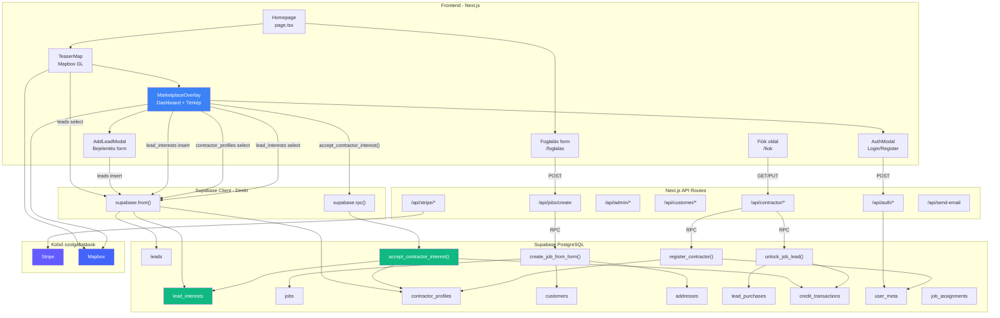
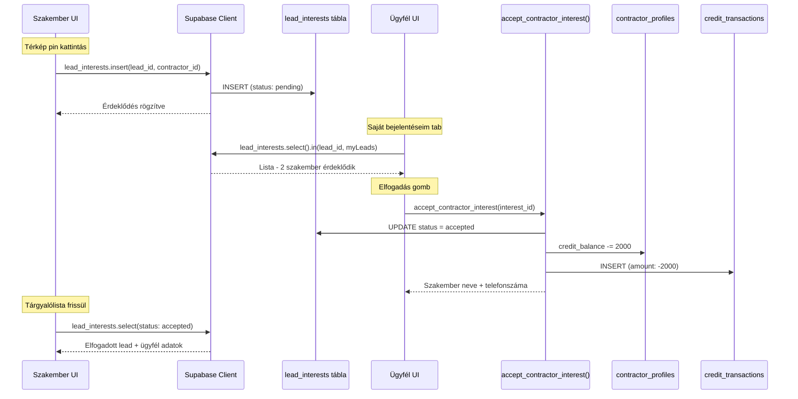
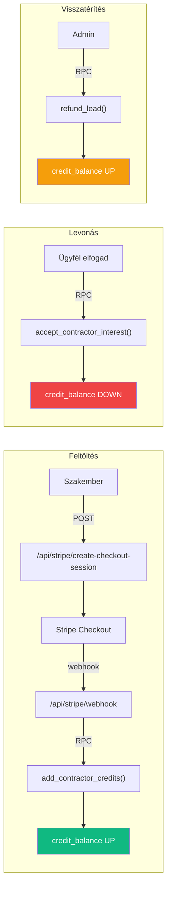

# 🔧 VizVillanyFutes.hu — Lead-Generation Marketplace

[](https://app.netlify.com/projects/vizvillanyfutes/deploys)

> Budapest és Pest megye vezető víz-, villany- és fűtésszerelő piactere. Ügyfelek bejelentik a hibát, szakemberek jelzik érdeklődésüket — kredit csak elfogadás után vonódik le.

---

## 🏗️ Rendszer Architektúra



---

## 💡 Üzleti Logika

### Felhasználói szerepkörök

| Szerep | Leírás | Regisztráció |
|--------|--------|-------------|
| **Ügyfél** | Hibát jelent, szakembert fogad el | Regisztráció → `user_meta.role = 'customer'` |
| **Szakember** | Érdeklődik munkák iránt, elvégzi a munkát | Regisztráció → jóváhagyásra vár → admin aktiválja |
| **Admin** | Szakembereket kezel, krediteket ad, munkákat oszt | Manuális |
| **Diszpécser** | Munkákat oszt ki (legacy modell) | Manuális |

### Lead Érdeklődés Flow (Fő üzleti folyamat)



> **Kulcs szabály:** A kredit **csak akkor** vonódik le, ha az ügyfél **elfogadja** a szakembert. A szakember soha nem fizet üres leadért.

### Kredit Rendszer



**Lead ár:** 2 000 Ft / lead (rögzítve a `lead_interests.price_at_interest` mezőben az érdeklődés pillanatában).

### Szakember Regisztráció Flow

```
1. Szakember kitölti a regisztrációs form-ot → POST /api/contractors/register
2. register_contractor() RPC: user_meta (role: contractor, status: pending_approval) + contractor_profiles
3. Admin Dashboard-on jóváhagyja → approve_contractor() → status = approved
4. Szakember belép → látja a térképet, érdeklődhet munkák iránt
```

### Ügyfél Bejelentés Flow

```
1. Ügyfél regisztrál/belép → AuthModal (Supabase Auth)
2. Térképen kattint → AddLeadModal megnyílik
3. Kitölti: típus, cím, leírás, lokáció → leads táblába INSERT
4. Pin megjelenik a térképen valós időben
5. Szakemberek látják és érdeklődhetnek
```

### Foglalási Form Flow (B2C)

```
1. Ügyfél kitölti a /foglalas oldalt → POST /api/jobs/create
2. create_job_from_form() RPC: customer upsert + address insert + job insert (atomikus)
3. Job megjelenik az admin/diszpécser dashboard-on
4. Admin kiosztja szakembernek → assign_job_to_contractor()
5. Szakember elfogadja → contractor_respond_to_assignment(action: accept)
6. Munka elvégzése → contractor_update_job_status(status: completed)
```

---

## 🗄️ Adatbázis Séma

### Táblák

| Tábla | Oszlopok (kulcs) | Leírás |
|-------|-----------------|--------|
| `user_meta` | `user_id`, `role`, `status` | Auth user → szerepkör mapping |
| `contractor_profiles` | `user_id`, `display_name`, `phone`, `trades[]`, `service_areas[]`, `credit_balance`, `status` | Teljes szakember profil + kredit |
| `customers` | `full_name`, `phone`, `email`, `type`, `user_id` | Ügyfél adatok |
| `addresses` | `customer_id`, `city`, `district`, `postal_code`, `street`, `house_number` | Címek |
| `jobs` | `customer_id`, `address_id`, `trade`, `status`, `priority`, `lead_price`, `latitude`, `longitude` | Munka megrendelések |
| `job_assignments` | `job_id`, `contractor_id`, `status`, `confirmed_start_time` | Diszpécser → szakember kiosztás |
| `leads` | `user_id`, `lat`, `lng`, `type`, `title`, `description`, `district`, `status`, `contact_*` | Térképes bejelentések |
| `lead_interests` | `lead_id`, `contractor_id`, `status`, `contractor_name`, `price_at_interest` | Szakember érdeklődések (halasztott kredit) |
| `lead_purchases` | `job_id`, `contractor_id`, `price_paid` | Jobs tábla alapú lead vásárlás |
| `credit_transactions` | `contractor_id`, `amount`, `transaction_type`, `reference_id` | Kredit mozgások napló |

### Státusz értékek

**Jobs:** `new` → `open` → `unlocked` → `completed` / `cancelled_by_customer`
**Legacy:** `new` → `unassigned` → `assigned` → `scheduled` → `in_progress` → `completed`
**Lead interests:** `pending` → `accepted` / `rejected` / `withdrawn`
**Contractor:** `pending_approval` → `approved` / `rejected`

### RPC Függvények

| Függvény | Paraméterek | Logika |
|----------|------------|--------|
| `create_job_from_form()` | ügyfél+cím+munka adatok | Atomikus: customer upsert → address insert → job insert |
| `register_contractor()` | user_id, profil adatok | user_meta + contractor_profiles insert |
| `assign_job_to_contractor()` | job_id, contractor_id | Admin jogosultság ellenőrzés → assignment insert → job status: assigned |
| `contractor_respond_to_assignment()` | assignment_id, action | accept: status=accepted, job=scheduled / decline: status=declined, job=unassigned |
| `contractor_update_job_status()` | job_id, new_status | Jogosultság + státusz átmenet validálás → update |
| `approve_contractor()` | contractor_id | Admin: contractor status=approved, user_meta status=active |
| `reject_contractor()` | contractor_id | Admin: contractor status=rejected, user_meta status=suspended |
| `unlock_job_lead()` | job_id | Kredit ellenőrzés → levonás → lead_purchase insert → job status: unlocked |
| `add_contractor_credits()` | contractor_id, amount | Admin: credit_balance += amount + credit_transaction |
| `refund_lead()` | purchase_id | Admin: credit visszaírás + credit_transaction |
| `accept_contractor_interest()` | interest_id | **Halasztott modell:** auth.uid() == lead owner → kredit levonás → status: accepted |

---

## 🛣️ API Route-ok (28 db)

### 🔐 Auth
| Route | Method | Funkció |
|-------|--------|---------|
| `/api/auth/login` | POST | Email + jelszó bejelentkezés (Supabase Auth) |
| `/api/auth/logout` | POST | Session törlés |
| `/api/auth/session` | GET | Aktuális session + user_meta lekérdezés |
| `/api/auth/forgot-password` | POST | Jelszó-emlékeztető email küldés |
| `/api/auth/reset-password` | POST | Új jelszó beállítás token-nel |

### 👷 Contractor
| Route | Method | Funkció |
|-------|--------|---------|
| `/api/contractor/profile` | GET/PUT | Saját profil lekérdezés és módosítás |
| `/api/contractor/jobs` | GET | Elérhető munkák listája (szűrve trade + area) |
| `/api/contractor/jobs/[id]` | GET | Egy munka részletei (ha unlocked: ügyfél adatok is) |
| `/api/contractor/jobs/[id]/unlock` | POST | Lead megvásárlása → `unlock_job_lead()` RPC |
| `/api/contractor/marketplace` | GET | Nyitott munkák térkép nézethez |
| `/api/contractor/assignments` | GET | Kiosztott munkák (diszpécser modell) |
| `/api/contractor/assignments/[id]/respond` | POST | Munka elfogadás/elutasítás |
| `/api/contractors/register` | POST | Szakember regisztráció form → `register_contractor()` |

### 🏢 Admin
| Route | Method | Funkció |
|-------|--------|---------|
| `/api/admin/contractors` | GET | Összes szakember listája + szűrés |
| `/api/admin/contractors/[id]` | GET/PUT | Szakember részletek és módosítás |
| `/api/admin/contractors/[id]/approve` | POST | Jóváhagyás → `approve_contractor()` |
| `/api/admin/contractors/[id]/reject` | POST | Elutasítás → `reject_contractor()` |
| `/api/admin/contractors/[id]/activate` | POST | Újra aktiválás |
| `/api/admin/contractors/[id]/suspend` | POST | Felfüggesztés |
| `/api/admin/customers` | GET | Ügyfél lista |
| `/api/admin/jobs` | GET | Összes munka lista |
| `/api/admin/jobs/[id]` | GET/PUT | Munka módosítás |
| `/api/admin/jobs/assign` | POST | Munka kiosztás → `assign_job_to_contractor()` |

### 👤 Customer & Egyéb
| Route | Method | Funkció |
|-------|--------|---------|
| `/api/customer/jobs/[id]` | GET | Ügyfél saját munkájának részletei |
| `/api/jobs/create` | POST | Foglalási form → `create_job_from_form()` |
| `/api/stripe/create-checkout-session` | POST | Stripe fizetési session (kredit feltöltés) |
| `/api/stripe/webhook` | POST | Stripe webhook → `add_contractor_credits()` |
| `/api/send-email` | POST | Általános email küldés |

---

## 🔒 Row Level Security (RLS)

Minden tábla RLS-sel védett. A policy-k biztosítják, hogy:

| Tábla | Szabály |
|-------|---------|
| `user_meta` | Mindenki csak a saját rekordját látja |
| `contractor_profiles` | Saját profil + admin/diszpécser az összeset |
| `customers` | Saját profil (`user_id` match) + admin az összeset |
| `jobs` | Admin mindent lát; contractor `open` + saját purchased; customer sajátját |
| `lead_purchases` | Contractor a sajátját, admin mindent |
| `credit_transactions` | Contractor a sajátját, admin mindent |
| `lead_interests` | Contractor saját érdeklődéseit; lead owner a saját leadjein lévőket |
| `leads` | Authenticated userek (olvasás + saját insert/delete) |

**Helper funkciók:**
- `is_admin_or_dispatcher()` — admin/diszpécser jogosultság check
- `is_contractor()` — szakember jogosultság check
- `get_contractor_profile_id()` — auth.uid() → contractor_profiles.id mapping

---

## 🖥️ Frontend Oldalak (30 route)

### Publikus oldalak
| Útvonal | Leírás |
|---------|--------|
| `/` | Landing page — hero, térkép, hogyan működik, blog |
| `/foglalas` | Foglalási form (B2C ügyfelek) |
| `/arak` | Árkalkulátor |
| `/vizszerelo-budapest` | SEO landing — vízszerelés |
| `/villanyszerelo-budapest` | SEO landing — villanyszerelés |
| `/futeskorszerusites` | SEO landing — fűtéskorszerűsítés |
| `/dugulaselharitas-budapest` | SEO landing — duguláselhárítás |
| `/szolgaltatasi-teruletek` | Szolgáltatási terület lista |
| `/csatlakozz-partnerkent` | Szakember toborzó oldal |
| `/general-kivitelezo-partner` | Generál kivitelező partner oldal |
| `/blog` / `/blog/[id]` | Blog lista és cikk |
| `/gyik` | GYIK |
| `/rolunk` | Rólunk |
| `/kapcsolat` | Kapcsolat |
| `/visszahivas` | Visszahívás kérés |
| `/palyazat-kalkulator` | Pályázat kalkulátor |
| `/aszf` / `/cookie` / `/impresszum` / `/adatkezeles` | Jogi oldalak |

### Autentikált oldalak
| Útvonal | Szerep | Leírás |
|---------|--------|--------|
| `/login` | Mindenki | Bejelentkezés |
| `/forgot-password` / `/reset-password` | Mindenki | Jelszó kezelés |
| `/fiok` | Mindenki | Saját fiók beállítások |
| `/admin` | Admin | Admin dashboard |
| `/contractor/dashboard` | Szakember | Szakember dashboard |
| `/contractor/profile` | Szakember | Profil szerkesztés |
| `/contractor/topup` | Szakember | Kredit feltöltés (Stripe) |
| `/ugyfel/dashboard` | Ügyfél | Ügyfél saját munkái |

### Kulcs komponensek
| Komponens | Funkció |
|-----------|---------|
| `TeaserMap` | Interaktív Mapbox térkép a homepage-en, lead pin-ek, overlay indítás |
| `MarketplaceSimulationOverlay` | Teljes screen dashboard: térkép + sidebar, lead lista, érdeklődés, elfogadás |
| `AddLeadModal` | Új hiba bejelentés form (típus, lokáció, leírás) |
| `AuthModal` | Bejelentkezés/regisztráció overlay |
| `Header` | Navigáció, role-based menü |
| `HowItWorksAnimation` | Animált "Hogyan működik" szekció |
| `JobCard` | Munka kártya (admin/szakember nézet) |
| `ContractorCard` | Szakember kártya (admin nézet) |
| `ProtectedRoute` | Auth guard wrapper |
| `CookieConsent` | GDPR cookie consent |

---

## 🗂️ Migráció Történet

| # | Fájl | Mit csinál |
|---|------|------------|
| 001 | `create_tables.sql` | Alap táblák: user_meta, contractor_profiles, customers, addresses, jobs, job_assignments |
| 002 | `rls_policies.sql` | RLS policy-k minden táblára + helper funkciók |
| 003 | `functions.sql` | 7 RPC: create_job_from_form, register_contractor, assign/respond/update job, approve/reject contractor |
| 004 | `seed_data.sql` | Teszt admin user + minta adatok |
| 005 | `marketplace_refactor.sql` | Marketplace átállás: credit_balance, lead_purchases, credit_transactions, unlock/refund/add_credits RPC, open_jobs_map view |
| 006 | `add_job_timestamps.sql` | Job timestamp mezők |
| 007 | `customer_profiles.sql` | Customer user_id hozzáadás + RLS, create_job_from_form frissítés user_id supporttal |
| 008 | `lead_interests.sql` | lead_interests tábla + accept_contractor_interest RPC (halasztott kredit modell) |

---

## ⚙️ Tech Stack

| Réteg | Technológia |
|-------|-------------|
| Frontend | Next.js 14, React, TypeScript, Tailwind CSS |
| Térkép | Mapbox GL JS (`react-map-gl`) |
| Backend | Next.js API Routes + Supabase RPC |
| Adatbázis | PostgreSQL (Supabase) |
| Auth | Supabase Auth (email/password) |
| Fizetés | Stripe Checkout + Webhooks |
| Hosting | Netlify |
| Email | Supabase Edge / API route |

---

## 🚀 Fejlesztés

```bash
# Telepítés
npm install

# Fejlesztői szerver
npm run dev

# Build
npm run build

# Környezeti változók (.env.local)
NEXT_PUBLIC_SUPABASE_URL=https://xxxxx.supabase.co
NEXT_PUBLIC_SUPABASE_ANON_KEY=sb_publishable_xxxxx
SUPABASE_SERVICE_ROLE_KEY=sb_secret_xxxxx
NEXT_PUBLIC_MAPBOX_TOKEN=pk.xxxxx
```

---

## 📁 Mappastruktúra

```
src/
├── app/                    # Next.js pages (30 route)
│   ├── api/                # API routes (28 endpoint)
│   │   ├── auth/           # Login, logout, session, password
│   │   ├── admin/          # Contractor/job management
│   │   ├── contractor/     # Profile, jobs, marketplace, assignments
│   │   ├── customer/       # Customer job details
│   │   ├── stripe/         # Payment checkout + webhook
│   │   └── jobs/           # Job creation
│   ├── contractor/         # Szakember pages
│   ├── ugyfel/             # Ügyfél pages
│   └── [seo pages]/        # SEO landing pages
├── components/             # 16 React komponens
├── contexts/               # AuthContext (global auth state)
├── lib/                    # Supabase client, auth helpers, API utils
└── utils/                  # Phone formatting etc.

supabase/
└── migrations/             # 8 SQL migration (001-008)

docs/
└── ARCHITECTURE.md         # Ez a fájl
```
