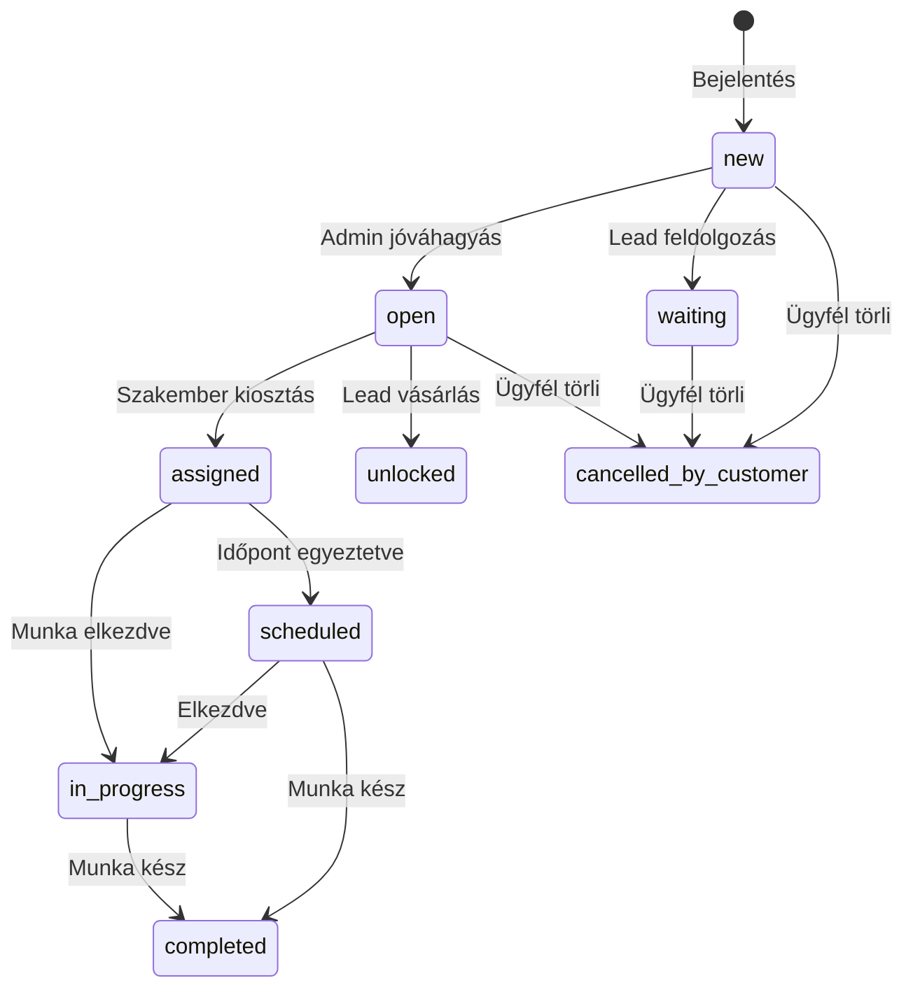
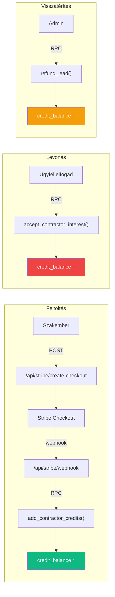
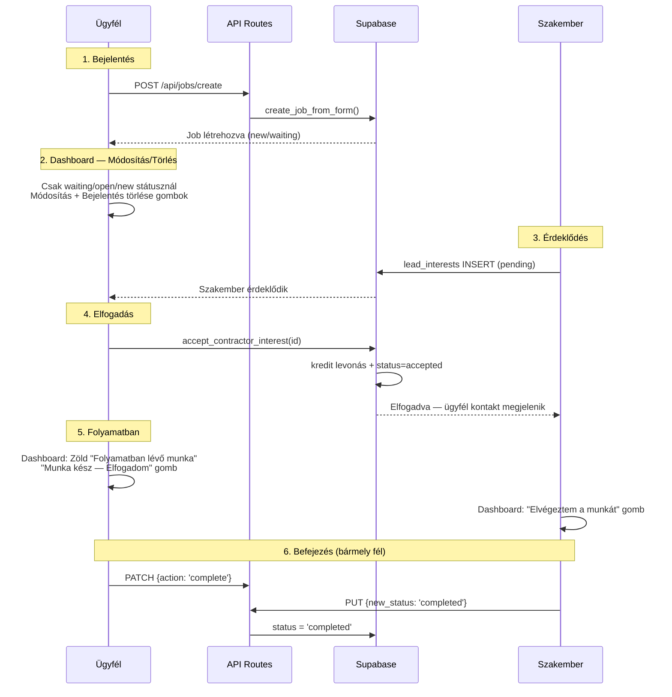

# 🔧 VízVillanyFűtés.hu — Lead-Generation Marketplace

[](https://app.netlify.com/projects/vizvillanyfutes/deploys)

> Budapest és Pest megye vezető víz-, villany- és fűtésszerelő piactere. Ügyfelek bejelentik a hibát, szakemberek jelzik érdeklődésüket — kredit csak elfogadás után vonódik le.

---

## 📐 Architekturális Áttekintés


```mermaid
graph TB
    subgraph "Frontend — Next.js 14"
        HP["Homepage<br/>page.tsx"]
        TM["TeaserMap<br/>Mapbox GL"]
        OV["MarketplaceOverlay<br/>Dashboard + Térkép"]
        AM["AddLeadModal<br/>Bejelentés form"]
        AUTH["AuthModal<br/>Login/Register"]
        FIOK["Fiók oldal<br/>/fiok"]
        FOG["Foglalás form<br/>/foglalas"]
        CD["Ügyfél Dashboard"]
        SD["Szakember Dashboard"]
    end

    subgraph "API Layer — Next.js Routes (33 db)"
        A_AUTH["/api/auth/*"]
        A_CONT["/api/contractor/*"]
        A_ADMIN["/api/admin/*"]
        A_CUST["/api/customer/*"]
        A_JOBS["/api/jobs/create"]
        A_STRIPE["/api/stripe/*"]
        A_EMAIL["/api/send-email"]
    end

    subgraph "Data Layer — Supabase PostgreSQL"
        T_JOBS["jobs"]
        T_CP["contractor_profiles"]
        T_CUST2["customers"]
        T_ADDR["addresses"]
        T_LP["lead_purchases"]
        T_CT["credit_transactions"]
        T_UM["user_meta"]
        T_JA["job_assignments"]
        T_LI["lead_interests"]
        T_LEADS["leads"]
        V_OJM["open_jobs_map (VIEW)"]
    end

    subgraph "Külső Szolgáltatások"
        STRIPE["Stripe Payments"]
        MAPBOX["Mapbox Maps"]
        RESEND["Resend Email"]
    end

    HP --> TM
    TM --> OV
    CD --> A_CUST
    SD --> A_CONT
    FOG --> A_JOBS
    AUTH --> A_AUTH
    A_STRIPE --> STRIPE
    A_EMAIL --> RESEND
    TM --> MAPBOX

    A_JOBS --> T_JOBS
    A_CUST --> T_JOBS
    A_CONT --> T_JOBS
    A_ADMIN --> T_JOBS

    style STRIPE fill:#635bff,color:#fff
    style MAPBOX fill:#4264fb,color:#fff
    style RESEND fill:#000,color:#fff
    style V_OJM fill:#10b981,color:#fff
```

---

## 🏗️ Data Engineering Elvek

### 1. Adatmodell Tervezés

Az alkalmazás **normalizált relációs modellt** követ:

```
customers (1) ──── (N) addresses
    │
    └── (1) ──── (N) jobs
                       │
                       ├── (N) job_assignments ──── (1) contractor_profiles
                       └── (N) lead_interests  ──── (1) contractor_profiles
```

**Tervezési elvek:**
- **3NF normalizáció** — Ügyfél, cím és munka adatok külön táblákban, idegen kulcsokkal
- **Immutable audit trail** — `credit_transactions` és `lead_purchases` csak INSERT, soha nem UPDATE/DELETE
- **Soft delete** — Munkák nem törlődnek, státuszt kapnak (`cancelled_by_customer`, `completed`)
- **Idempotens műveletek** — Stripe webhook handler `upsert` mintát követ
- **Atomikus tranzakciók** — Kritikus műveletek (kredit levonás + lead elfogadás) egyetlen RPC-ben futnak

### 2. Státusz Gépek (State Machines)

Minden entitás **jól definiált státusz átmenetekkel** rendelkezik:

#### Jobs státusz gép:

```mermaid
stateDiagram-v2
    [*] --> new: Bejelentés
    new --> open: Admin jóváhagyás
    new --> waiting: Lead feldolgozás
    open --> assigned: Szakember kiosztás
    open --> unlocked: Lead vásárlás
    assigned --> in_progress: Munka elkezdve
    assigned --> scheduled: Időpont egyeztetve
    in_progress --> completed: Munka kész
    scheduled --> in_progress: Elkezdve
    scheduled --> completed: Munka kész
    new --> cancelled_by_customer: Ügyfél törli
    open --> cancelled_by_customer: Ügyfél törli
    waiting --> cancelled_by_customer: Ügyfél törli
```

#### Contractor státusz gép:
```
pending_approval → approved → active
                 → rejected
                   active → suspended → active (újra)
```

#### Job Assignment státusz gép:
```
pending → accepted → completed
        → declined
```

### 3. Adat Integritás Rétegek

Az adatvédelem **három rétegen** valósul meg:

| Réteg | Implementáció | Cél |
|---|---|---|
| **1. RLS (Row Level Security)** | PostgreSQL policy-k | Adatbázis szintű hozzáférés-védelem |
| **2. API Auth** | `supabase.auth.getUser()` | Endpoint szintű autentikáció |
| **3. Ownership Check** | `customer_id === user.id` | Business logic szintű jogosultság |

```
┌───────────────────────────────────┐
│  Kliens kérés (Bearer token)      │
├───────────────────────────────────┤
│  API Route: getUser() → 401?      │ ← Auth réteg
├───────────────────────────────────┤
│  Ownership: job.customer_id       │ ← Business réteg
│  === user.id? → 403?              │
├───────────────────────────────────┤
│  Supabase RLS policy              │ ← DB réteg
│  (utolsó védvonal)                │
└───────────────────────────────────┘
```

### 4. Kredit Rendszer (Double-Entry Pattern)

A kredit rendszer **double-entry bookkeeping** elvét követi:


```mermaid
flowchart LR
    subgraph "Feltöltés"
        A["Szakember"] -->|POST| B["/api/stripe/create-checkout"]
        B --> C["Stripe Checkout"]
        C -->|webhook| D["/api/stripe/webhook"]
        D -->|RPC| E["add_contractor_credits()"]
        E --> F["credit_balance ↑"]
    end

    subgraph "Levonás"
        G["Ügyfél elfogad"] -->|RPC| H["accept_contractor_interest()"]
        H --> I["credit_balance ↓"]
    end

    subgraph "Visszatérítés"
        J["Admin"] -->|RPC| K["refund_lead()"]
        K --> L["credit_balance ↑"]
    end

    style F fill:#10b981,color:#fff
    style I fill:#ef4444,color:#fff
    style L fill:#f59e0b,color:#fff
```

**Minden egyenlegváltozás:**
1. `contractor_profiles.credit_balance` mező UPDATE
2. `credit_transactions` tábla INSERT (audit log, soha nem törölhető)
3. Egyetlen atomikus RPC-ben (konzisztencia garantált)

**Lead ár:** 2 000 Ft / lead (rögzítve a `lead_interests.price_at_interest` mezőben az érdeklődés pillanatában).

---

## 🔒 Biztonság

### API Autentikáció Mátrix

| API Route | Auth | Ownership | Admin Check | Rate Limit |
|---|:---:|:---:|:---:|:---:|
| `/api/jobs/create` | — | — | — | ✅ 3/perc/IP |
| `/api/send-email` | — | — | — | ✅ 5/perc/IP |
| `/api/customer/jobs/[id]` PATCH | ✅ | ✅ | — | — |
| `/api/customer/jobs/[id]` DELETE | ✅ | ✅ | — | — |
| `/api/customer/assignments/[id]/respond` | ✅ | ✅ | — | — |
| `/api/contractor/jobs/[id]` | ✅ | ✅ | — | — |
| `/api/contractor/marketplace` | ✅ | — | — | — |
| `/api/contractor/profile` | ✅ | ✅ | — | — |
| `/api/admin/*` (minden route) | ✅ | — | ✅ `is_admin_or_dispatcher()` | — |
| `/api/stripe/create-checkout` | ✅ | ✅ | — | — |
| `/api/stripe/webhook` | ✅ sig | — | — | — |

### Server-Side Client Elválasztás

```typescript
// Kliens oldal — Anon Key (RLS aktív)
createClient(SUPABASE_URL, ANON_KEY)          // supabase/client.ts

// Server — User context (RLS aktív, user token-nel)
createServerClient(authorizationHeader)       // supabase/server.ts

// Server — Admin (RLS BYPASS, service_role)
createAdminClient()                           // supabase/server.ts
```

> ⚠️ `createAdminClient()` RLS-t bypass-olja — ezért **minden** admin client használat mellett kódban ellenőrizzük az ownership-et.

### Rate Limiting

In-memory IP-alapú rate limiter (`src/lib/rate-limit.ts`):
- 5 perc-es időablak, automatikus cleanup
- IP detektálás: `x-forwarded-for` → `x-real-ip` → fallback
- Napi 100+ felhasználónál is hatékony

### Row Level Security (RLS)

| Tábla | Policy |
|---|---|
| `user_meta` | Saját rekord only |
| `contractor_profiles` | Saját + admin mindent |
| `customers` | Saját (`user_id` match) + admin |
| `jobs` | Customer sajátját (`customer_id`), contractor `open` + purchased, admin mindent |
| `lead_interests` | Contractor sajátját, lead owner a saját leadjein lévőket |
| `leads` | Authenticated read + saját insert/delete |
| `credit_transactions` | Contractor sajátját, admin mindent |

---

## 💡 Üzleti Logika

### Felhasználói Szerepkörök

| Szerep | Leírás | Regisztráció |
|---|---|---|
| **Ügyfél** | Hibát jelent, szakembert fogad el, munkát befejez | Regisztráció → `user_meta.role = 'customer'` |
| **Szakember** | Érdeklődik munkák iránt, elvégzi a munkát | Regisztráció → jóváhagyásra vár → admin aktiválja |
| **Admin** | Szakembereket kezel, krediteket ad, munkákat oszt | Manuális |
| **Diszpécser** | Munkákat oszt ki | Manuális |

### Munka Életciklus (Job Lifecycle)


```mermaid
sequenceDiagram
    participant Ü as Ügyfél
    participant API as API Routes
    participant DB as Supabase
    participant Sz as Szakember

    Note over Ü: 1. Bejelentés
    Ü->>API: POST /api/jobs/create
    API->>DB: create_job_from_form()
    DB-->>Ü: Job létrehozva (new/waiting)

    Note over Ü: 2. Dashboard — Módosítás/Törlés
    Ü->>Ü: Csak waiting/open/new státusznál<br/>Módosítás + Bejelentés törlése gombok

    Note over Sz: 3. Érdeklődés
    Sz->>DB: lead_interests INSERT (pending)
    DB-->>Ü: Szakember érdeklődik

    Note over Ü: 4. Elfogadás
    Ü->>DB: accept_contractor_interest(id)
    DB->>DB: kredit levonás + status=accepted
    DB-->>Sz: Elfogadva — ügyfél kontakt megjelenik

    Note over Ü: 5. Folyamatban
    Ü->>Ü: Dashboard: Zöld "Folyamatban lévő munka"<br/>"Munka kész — Elfogadom" gomb
    Sz->>Sz: Dashboard: "Elvégeztem a munkát" gomb

    Note over Ü,Sz: 6. Befejezés (bármely fél)
    Ü->>API: PATCH {action: 'complete'}
    Sz->>API: PUT {new_status: 'completed'}
    API->>DB: status = 'completed'
```

### Ügyfél Dashboard Footer — Státusz Alapú Gombok

| Státusz | Gombok |
|---|---|
| `waiting`, `open`, `new` (nincs elfogadott szaki) | 📝 Módosítás + 🗑️ Bejelentés törlése |
| `assigned`, `in_progress`, `scheduled` (elfogadott szaki) | 🟢 "Folyamatban lévő munka" + ✅ "Munka kész — Elfogadom" |
| `completed`, `cancelled` | Nincs gomb |

### Szakember Dashboard — Aktív Munka Kártya

Elfogadott munkáknál megjelenik:
- 🎉 "Gratulálunk!" banner
- Ügyfél kontakt adatok (név, telefon, email)
- 📍 Waze + Google Maps navigáció
- ✅ "Elvégeztem a munkát" gomb

---

## 🗄️ Adatbázis Séma

### Táblák

| Tábla | Kulcs oszlopok | Leírás |
|---|---|---|
| `user_meta` | `user_id`, `role`, `status` | Auth user → szerepkör mapping |
| `contractor_profiles` | `user_id`, `display_name`, `phone`, `trades[]`, `service_areas[]`, `credit_balance`, `status` | Szakember profil + kredit |
| `customers` | `full_name`, `phone`, `email`, `type`, `user_id` | Ügyfél adatok |
| `addresses` | `customer_id`, `city`, `district`, `street` | Címek |
| `jobs` | `customer_id`, `address_id`, `trade`, `status`, `priority`, `latitude`, `longitude` | Munkák |
| `job_assignments` | `job_id`, `contractor_id`, `status` | Szakember kiosztás |
| `leads` | `user_id`, `lat`, `lng`, `type`, `title`, `status` | Térképes bejelentések |
| `lead_interests` | `lead_id`, `contractor_id`, `status`, `price_at_interest` | Érdeklődések (halasztott kredit) |
| `lead_purchases` | `job_id`, `contractor_id`, `price_paid` | Lead vásárlások |
| `credit_transactions` | `contractor_id`, `amount`, `transaction_type` | Kredit napló (append-only) |

### Views

| View | Leírás |
|---|---|
| `open_jobs_map` | Nyitott munkák térkép nézethez (lat, lng, trade, status, district) |

### RPC Függvények

| Függvény | Logika |
|---|---|
| `create_job_from_form()` | Atomikus: customer upsert → address → job insert |
| `register_contractor()` | user_meta + contractor_profiles |
| `assign_job_to_contractor()` | Admin check → assignment insert → status: assigned |
| `contractor_respond_to_assignment()` | accept/decline → status update |
| `accept_contractor_interest()` | Kredit levonás → status: accepted (atomikus) |
| `unlock_job_lead()` | Kredit check → levonás → lead_purchase |
| `add_contractor_credits()` | credit_balance += amount + transaction log |
| `approve_contractor()` / `reject_contractor()` | Admin contractor management |
| `is_admin_or_dispatcher()` | Jogosultság helper |

### Migrációk

| # | Fájl | Leírás |
|---|---|---|
| 001 | `create_tables.sql` | Alap táblák |
| 002 | `rls_policies.sql` | RLS policy-k + helper funkciók |
| 003 | `functions.sql` | 7 RPC függvény |
| 004 | `seed_data.sql` | Teszt adatok |
| 005 | `marketplace_refactor.sql` | Kredit rendszer: credit_balance, transactions, purchases |
| 006 | `add_job_timestamps.sql` | Timestamp mezők |
| 007 | `customer_profiles.sql` | Customer user_id + RLS |
| 008 | `lead_interests.sql` | lead_interests + accept RPC (halasztott kredit) |

---

## 🛣️ API Route-ok (33 db)

### 🔐 Auth (7 route)
| Route | Method | Funkció |
|---|---|---|
| `/api/auth/login` | POST | Email + jelszó belépés |
| `/api/auth/logout` | POST | Session törlés |
| `/api/auth/session` | GET | Aktuális session + user_meta |
| `/api/auth/forgot-password` | POST | Jelszó-emlékeztető |
| `/api/auth/reset-password` | POST | Új jelszó beállítás |
| `/api/auth/send-verification` | POST | Email verifikáció küldés |
| `/api/auth/verify-code` | POST | Kód ellenőrzés |

### 👷 Contractor (9 route)
| Route | Method | Funkció |
|---|---|---|
| `/api/contractor/profile` | GET/PUT | Profil lekérdezés/módosítás |
| `/api/contractor/jobs` | GET | Elérhető munkák listája |
| `/api/contractor/jobs/[id]` | GET/PUT | Munka részletek/státusz update |
| `/api/contractor/jobs/[id]/unlock` | POST | Lead vásárlás (kredit) |
| `/api/contractor/jobs/[id]/interest` | POST | Érdeklődés jelzése |
| `/api/contractor/marketplace` | GET | Nyitott munkák térkép nézethez |
| `/api/contractor/assignments` | GET | Kiosztott munkák |
| `/api/contractor/assignments/[id]/respond` | POST | Elfogadás/elutasítás |
| `/api/contractors/register` | POST | Szakember regisztráció |

### 🏢 Admin (10 route)
| Route | Method | Funkció |
|---|---|---|
| `/api/admin/contractors` | GET | Szakember lista |
| `/api/admin/contractors/[id]` | GET/PUT | Szakember részletek/módosítás |
| `/api/admin/contractors/[id]/approve` | POST | Jóváhagyás |
| `/api/admin/contractors/[id]/reject` | POST | Elutasítás |
| `/api/admin/contractors/[id]/activate` | POST | Újra aktiválás |
| `/api/admin/contractors/[id]/suspend` | POST | Felfüggesztés |
| `/api/admin/customers` | GET | Ügyfél lista |
| `/api/admin/jobs` | GET/PUT | Munkák kezelése |
| `/api/admin/jobs/[id]` | GET/PUT | Munka módosítás |
| `/api/admin/jobs/assign` | POST | Munka kiosztás |

### 👤 Customer (2 route)
| Route | Method | Funkció |
|---|---|---|
| `/api/customer/jobs/[id]` | GET/PATCH/DELETE | Saját munka kezelés (cancel/complete) |
| `/api/customer/assignments/[id]/respond` | POST | Szakember elfogadás/elutasítás |

### 💳 Stripe + Email (5 route)
| Route | Method | Funkció | Védelem |
|---|---|---|---|
| `/api/jobs/create` | POST | Munka létrehozás (publikus) | Rate limit 3/perc/IP |
| `/api/stripe/create-checkout-session` | POST | Stripe fizetés | Auth |
| `/api/stripe/webhook` | POST | Stripe webhook | Signature |
| `/api/send-email` | POST | Email küldés | Rate limit 5/perc/IP |

---

## 🖥️ Frontend Oldalak

### Publikus (20+ route)
| Útvonal | Leírás |
|---|---|
| `/` | Landing — hero, térkép, hogyan működik |
| `/foglalas` | Foglalási form |
| `/arak` | Árkalkulátor |
| `/vizszerelo-budapest` | SEO landing — vízszerelés |
| `/villanyszerelo-budapest` | SEO landing — villanyszerelés |
| `/futeskorszerusites` | SEO landing — fűtéskorszerűsítés |
| `/dugulaselharitas-budapest` | SEO landing — duguláselhárítás |
| `/szolgaltatasi-teruletek` | Terület lista |
| `/csatlakozz-partnerkent` | Szakember toborzó |
| `/general-kivitelezo-partner` | Generál kivitelező partner |
| `/blog`, `/blog/[id]` | Blog |
| `/gyik` | GYIK |
| `/rolunk`, `/kapcsolat` | Rólunk, Kapcsolat |
| `/palyazat-kalkulator` | Pályázat kalkulátor |
| `/aszf`, `/cookie`, `/impresszum`, `/adatkezeles` | Jogi oldalak |

### Autentikált
| Útvonal | Szerep | Leírás |
|---|---|---|
| `/login` | Mindenki | Bejelentkezés |
| `/forgot-password` / `/reset-password` | Mindenki | Jelszó kezelés |
| `/fiok` | Mindenki | Fiók beállítások |
| `/admin` | Admin | Admin dashboard |
| `/contractor/dashboard` | Szakember | Térkép + munkák + aktív megbízások |
| `/contractor/profile` | Szakember | Profil szerkesztés |
| `/contractor/topup` | Szakember | Kredit feltöltés (Stripe) |
| `/ugyfel/dashboard` | Ügyfél | Munkák kezelése (térkép + részletek) |

### Kulcs Komponensek (17 db)

| Komponens | Méret | Funkció |
|---|---|---|
| `MarketplaceSimulationOverlay` | 63KB | Full-screen marketplace: térkép + sidebar |
| `TeaserMap` | 32KB | Homepage interaktív térkép, lead pin-ek |
| `AddLeadModal` | 31KB | Hiba bejelentés form (típus, lokáció, leírás) |
| `HowItWorksAnimation` | 27KB | Animált "Hogyan működik" szekció |
| `Header` | 19KB | Navigáció, role-based menü |
| `JobCard` | 17KB | Munka kártya (admin/szakember) |
| `UnauthMapLibreMap` | 15KB | MapLibre fallback térkép |
| `CookieConsent` | 11KB | GDPR cookie consent |
| `Footer` | 10KB | Footer |
| `ContractorCard` | 6KB | Szakember kártya (admin) |
| `ShareButtons` | 5KB | Megosztás gombok |
| `Breadcrumbs` | 5KB | Navigációs morzsa |
| `AuthModal` | 4KB | Login/regisztráció overlay |
| `Toast` | 3KB | Értesítés toast |
| `ProtectedRoute` | 3KB | Auth guard wrapper |
| `Logo` | 2KB | Logo |
| `ConditionalFooter` | 1KB | Feltételes footer |

---

## ⚙️ Tech Stack

| Réteg | Technológia | Verzió |
|---|---|---|
| Frontend | Next.js, React, TypeScript | 14.2.0 |
| Styling | Tailwind CSS | 3.x |
| Térkép | Mapbox GL JS (`react-map-gl`) | — |
| Backend | Next.js API Routes + Supabase RPC | — |
| Adatbázis | PostgreSQL (Supabase) | 15 |
| Auth | Supabase Auth (email/password) | — |
| Fizetés | Stripe Checkout + Webhooks | — |
| Email | Resend | — |
| Hosting | Netlify | — |
| Rate Limiting | In-memory (IP-based) | — |

---

## 🚀 Fejlesztés

### Telepítés

```bash
npm install
```

### Fejlesztői szerver

```bash
npm run dev
# → http://localhost:3000
```

### Build

```bash
npm run build
```

### Környezeti Változók (`.env.local`)

```env
# Supabase
NEXT_PUBLIC_SUPABASE_URL=https://xxxxx.supabase.co
NEXT_PUBLIC_SUPABASE_ANON_KEY=sb_publishable_xxxxx
SUPABASE_SERVICE_ROLE_KEY=sb_secret_xxxxx

# Mapbox
NEXT_PUBLIC_MAPBOX_TOKEN=pk.xxxxx

# Resend Email
RESEND_API_KEY=re_xxxxx
EMAIL_TO=info@vizvillanyfutes.hu
ADMIN_EMAIL=admin@vizvillanyfutes.hu
DISPATCHER_EMAIL=dispatcher@vizvillanyfutes.hu
NEXT_PUBLIC_BASE_URL=https://vizvillanyfutes.hu

# Stripe
STRIPE_SECRET_KEY=sk_live_xxxxx
NEXT_PUBLIC_STRIPE_PUBLISHABLE_KEY=pk_live_xxxxx
STRIPE_WEBHOOK_SECRET=whsec_xxxxx
```

### Deploy

```bash
# Netlify-re deploy (production)
netlify deploy --prod
```

---

## 📁 Mappastruktúra

```
src/
├── app/                        # Next.js pages
│   ├── api/                    # 33 API route
│   │   ├── auth/               # Login, logout, session, password, verification
│   │   ├── admin/              # Contractor/job management (is_admin_or_dispatcher check)
│   │   ├── contractor/         # Profile, jobs, marketplace, assignments
│   │   ├── customer/           # Job management (cancel, complete, assignment respond)
│   │   ├── stripe/             # Payment checkout + webhook
│   │   ├── jobs/               # Job creation (rate limited)
│   │   └── send-email/         # Email dispatch (rate limited)
│   ├── (dashboard)/            # Ügyfél dashboard (grouped route)
│   ├── contractor/             # Szakember pages (dashboard, profile, topup)
│   ├── admin/                  # Admin dashboard
│   └── [seo-pages]/            # 10+ SEO landing page
├── components/                 # 17 React komponens
├── contexts/                   # AuthContext (global auth state)
├── lib/
│   ├── supabase/               # Client (anon), Server (user), Admin (service_role)
│   ├── services/               # jobService (create, normalize, notify)
│   ├── auth.ts                 # Session management (localStorage)
│   ├── api.ts                  # API helper (GET, POST, PUT, DELETE with auth)
│   └── rate-limit.ts           # In-memory IP-based rate limiter
└── utils/                      # Phone formatting etc.

supabase/
└── migrations/                 # 8 SQL migration (001-008)
```

---

## 📊 Méretezés + Teljesítmény

| Metrika | Szint | Megjegyzés |
|---|---|---|
| Napi felhasználók | 100-1000 | Supabase Free/Pro bőven elég |
| API kérések | ~50K/hó | Supabase Free tier limit: 500K |
| DB méret | <100MB | Supabase Free: 500MB |
| Rate limiter | In-memory | Serverless cold start-nál resetelődik — ez feature, nem bug |
| Térkép | Mapbox Free | 50K tile load/hó |
| Email | Resend Free | 100 email/nap |

**Skálázási szükséglet esetén:**
- Rate limiter → Redis (Upstash)
- DB → Supabase Pro
- Email → Resend Pro
- Térkép → Mapbox Pay-as-you-go
