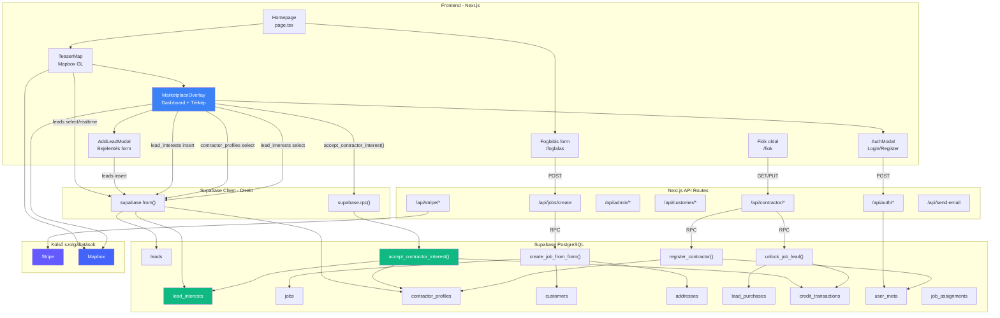
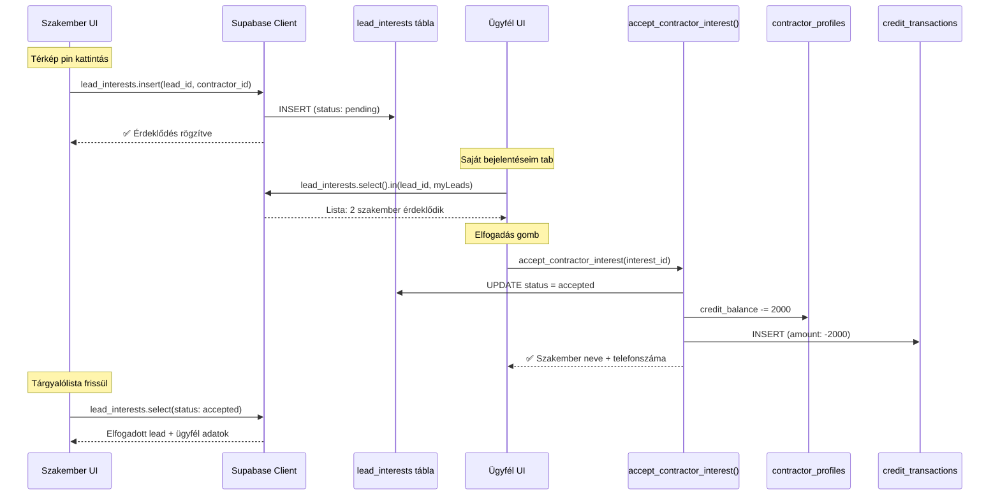
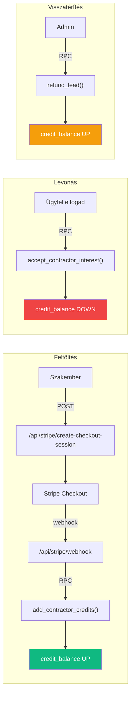

# VizVillanyFutes.hu — Rendszer Architektúra & Backend Dokumentáció

---

## 🏗️ Rendszer Architektúra

---

## 🔄 Lead Érdeklődés Flow

---

## 💰 Kredit Rendszer Flow

---

## 🗄️ Adatbázis táblák

| Tábla | Leírás | Migration |
|-------|--------|-----------|
| `user_meta` | User szerepkör (admin/dispatcher/contractor/customer) + státusz | 001 |
| `contractor_profiles` | Szakember profil: név, telefon, szakterületek, kredit egyenleg | 001 + 005 |
| `customers` | Ügyfél adatok: név, telefon, email, típus (b2c/b2b) | 001 + 007 |
| `addresses` | Címek: város, kerület, irányítószám, utca, házszám | 001 |
| `jobs` | Munka megrendelések: státusz, szakterület, prioritás, lead ár, GPS | 001 + 005 |
| `job_assignments` | Munka kiosztás szakembereknek (diszpécser modell) | 001 |
| `leads` | Térképes bejelentések: lat/lng, típus, cím, leírás | külön |
| `lead_purchases` | Lead vásárlások (jobs tábla alapú) | 005 |
| `credit_transactions` | Kredit mozgások: feltöltés, levonás, visszatérítés | 005 |
| `lead_interests` | Szakember érdeklődés leadekre, halasztott kredit modell | 008 |

---

## ⚡ RPC Függvények

| Függvény | Mit csinál | Migration |
|----------|-----------|-----------|
| `create_job_from_form()` | Webes foglalásból ügyfél+cím+munka létrehozás (atomikus) | 003 |
| `register_contractor()` | Szakember regisztráció: user_meta + contractor_profile | 003 |
| `assign_job_to_contractor()` | Admin kioszt munkát szakembernek | 003 |
| `contractor_respond_to_assignment()` | Szakember elfogadja/elutasítja munkát | 003 |
| `contractor_update_job_status()` | Munka státusz frissítés (in_progress → completed) | 003 |
| `approve_contractor()` | Admin jóváhagyja szakembert | 003 |
| `reject_contractor()` | Admin elutasítja szakembert | 003 |
| `unlock_job_lead()` | Lead megvásárlás (azonnali kredit levonás) | 005 |
| `add_contractor_credits()` | Admin kreditet ad | 005 |
| `refund_lead()` | Admin visszatéríti lead árát | 005 |
| `accept_contractor_interest()` | Ügyfél elfogadja érdeklődést → kredit levonás | 008 |

---

## 🛣️ API Route-ok (28 db)

### Auth (5)
| Route | Funkció |
|-------|---------|
| `POST /api/auth/login` | Bejelentkezés |
| `POST /api/auth/logout` | Kijelentkezés |
| `GET /api/auth/session` | Session lekérdezés |
| `POST /api/auth/forgot-password` | Jelszó emlékeztető |
| `POST /api/auth/reset-password` | Jelszó visszaállítás |

### Contractor (8)
| Route | Funkció |
|-------|---------|
| `GET/PUT /api/contractor/profile` | Saját profil |
| `GET /api/contractor/jobs` | Elérhető munkák |
| `GET /api/contractor/jobs/[id]` | Munka részletek |
| `POST /api/contractor/jobs/[id]/unlock` | Lead vásárlás |
| `GET /api/contractor/marketplace` | Nyitott munkák (térkép) |
| `GET /api/contractor/assignments` | Kiosztott munkák |
| `POST /api/contractor/assignments/[id]/respond` | Elfogadás/elutasítás |
| `POST /api/contractors/register` | Regisztráció |

### Admin (10)
| Route | Funkció |
|-------|---------|
| `GET /api/admin/contractors` | Szakember lista |
| `GET/PUT /api/admin/contractors/[id]` | Részletek/módosítás |
| `POST /api/admin/contractors/[id]/approve` | Jóváhagyás |
| `POST /api/admin/contractors/[id]/reject` | Elutasítás |
| `POST /api/admin/contractors/[id]/activate` | Aktiválás |
| `POST /api/admin/contractors/[id]/suspend` | Felfüggesztés |
| `GET /api/admin/customers` | Ügyfél lista |
| `GET /api/admin/jobs` | Munka lista |
| `GET/PUT /api/admin/jobs/[id]` | Munka módosítás |
| `POST /api/admin/jobs/assign` | Munka kiosztás |

### Customer + Egyéb (5)
| Route | Funkció |
|-------|---------|
| `GET /api/customer/jobs/[id]` | Saját munka részletei |
| `POST /api/jobs/create` | Új munka (foglalási form) |
| `POST /api/stripe/create-checkout-session` | Stripe fizetés |
| `POST /api/stripe/webhook` | Stripe webhook |
| `POST /api/send-email` | Email küldés |

---

## 🔒 RLS Biztonsági réteg

| Tábla | Ki látja? |
|-------|-----------|
| `user_meta` | Mindenki a sajátját |
| `contractor_profiles` | Saját + admin mindent |
| `customers` | Saját (user_id) + admin |
| `jobs` | Admin mindent, contractor open+saját, customer saját |
| `lead_purchases` | Contractor saját, admin mindent |
| `credit_transactions` | Contractor saját, admin mindent |
| `lead_interests` | Contractor saját, lead owner sajátjait |
| `leads` | Authenticated users |

---

## 🗂️ Migration-ök

| # | Fájl | Tartalom |
|---|------|----------|
| 001 | `create_tables.sql` | Alap táblák |
| 002 | `rls_policies.sql` | Row Level Security |
| 003 | `functions.sql` | 7 RPC függvény |
| 004 | `seed_data.sql` | Teszt adatok |
| 005 | `marketplace_refactor.sql` | Marketplace + kredit rendszer |
| 006 | `add_job_timestamps.sql` | Job időbélyegek |
| 007 | `customer_profiles.sql` | Ügyfél user_id + RLS |
| 008 | `lead_interests.sql` | Lead érdeklődés + accept RPC |
